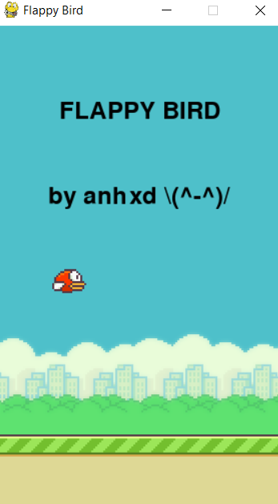

<h1 align="center" id="title">Flappy Bird</h1>
<h2 align="left" id="description">Description</h1>

This is a Python script implementing a simplified version of the classic game Flappy Bird using the Pygame library. The game also includes collision detection score counting and sound effects for various events like scoring points hitting obstacles and game over.

<h2 align="left" id="ps">Project Sreenshot</h1>

